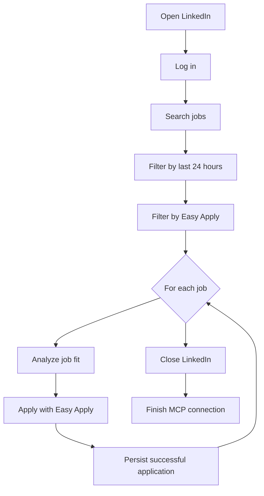

# Job Applier

[](https://github.com/0xthiagomartins/job-applier/actions/workflows/ci.yml)

Job Applier is an open source system for assisted job application automation with strong submission auditability.

## What the agent does



At a high level, the agent logs into LinkedIn, searches recent Easy Apply jobs, evaluates each opportunity, applies when the job passes the fit rules, saves the successful application, and then closes the browser flow cleanly.

The current repository bootstrap already includes:

- Python 3.14 project management with `uv`
- FastAPI backend API with panel configuration endpoints
- Next.js + TypeScript panel in `apps/panel` with shadcn-style components
- Ruff, mypy, pytest and pre-commit configuration
- GitHub Actions CI for lint, type-check and tests
- single-container on-premise runtime path with local SQLite fallback
- automatic Alembic upgrade to the latest schema on startup

## Getting started

1. Install Python 3.14 and `uv`.
2. Sync the environment:

   ```bash
   uv sync --all-groups
   ```

3. Install the git hooks:

   ```bash
   uv run pre-commit install
   ```

4. Start the backend API locally:

   ```bash
   uv run uvicorn job_applier.main:app --reload
   ```

5. Install panel dependencies:

   ```bash
   cd apps/panel
   npm install
   ```

6. Start the panel locally:

   ```bash
   npm run dev
   ```

7. Check the backend health endpoint:

   ```bash
   curl http://127.0.0.1:8000/health
   ```

8. Open the panel at `http://127.0.0.1:3000`.

## LinkedIn search setup

The LinkedIn Jobs search automation reads credentials from local runtime config, never from versioned code.

Add these keys to your local `.env`:

```bash
JOB_APPLIER_LINKEDIN_EMAIL="you@example.com"
JOB_APPLIER_LINKEDIN_PASSWORD="your-linkedin-password"
JOB_APPLIER_PLAYWRIGHT_HEADLESS=false
```

Runtime behavior:

- the first successful login saves a reusable session in `artifacts/runtime/linkedin/storage-state.json`;
- persistent runtime state lives under `artifacts/runtime/`;
- the troubleshooting bundle for only the latest execution lives under `artifacts/last-run/`;
- later runs reuse that storage state automatically;
- if LinkedIn expires the session, the app clears the saved state and logs in again;
- when `JOB_APPLIER_PLAYWRIGHT_MCP_URL` is configured, the login bootstrap runs through Playwright MCP and exports the storage state back to the Python app;
- in headful mode, the browser stays visible so the user can solve captcha or checkpoint screens.
- when the panel state is still empty, the app bootstraps a local profile automatically from `.env` and tries to import a CV from `~/Documents`.

## Last-run troubleshooting

When you click `Run now`, the app resets `artifacts/last-run/` and keeps only the latest execution bundle:

- `summary.json`: final outcome and counters
- `progress.json`: current stage, current job and current step
- `timeline.jsonl`: ordered execution timeline across orchestration, search and Easy Apply
- `artifacts.jsonl`: index of screenshots, HTML dumps and traces created during the run
- `run.log`: structured logs for deeper debugging

The durable evidence for the product itself still lives under `artifacts/runtime/`. The `last-run` bundle exists only to make troubleshooting the latest execution fast and readable.

For deeper agent debugging, the last-run bundle now also keeps machine-oriented traces:

- `llm/browser-agent.jsonl`: structured prompt/response records for planning and assessment calls
- `browser-agent/task-trace.jsonl`: snapshot -> action -> result trace for multi-step browser tasks
- `browser-agent/single-action-trace.jsonl`: focused micro-action traces used inside Easy Apply

For low-cost manual debugging, you can enable `JOB_APPLIER_AGENT_TEST_MODE=true`. In this mode the app processes only 1 selected job per run, disables OpenAI HTTP retries, and keeps the richer browser-agent traces so we can refine prompts without falling back to brittle heuristics. If you need to force one near-match through the pipeline while debugging the apply flow, set `JOB_APPLIER_AGENT_TEST_MINIMUM_SCORE_THRESHOLD` too.

For immediate iteration on a single problematic job, set `JOB_APPLIER_LINKEDIN_DEBUG_TARGET_JOB_URL=https://www.linkedin.com/jobs/view/...`. In that mode the agent bypasses the search pages and opens the target job directly, which is much faster when we are polishing the Easy Apply agent. When `JOB_APPLIER_AGENT_TEST_MODE=true`, this direct-target mode also relaxes the score threshold to `0.0` automatically so the debug run reaches `Easy Apply` instead of being blocked by ranking.

## Quality commands

Run lint:

```bash
uv run ruff check .
uv run ruff format --check .
```

Run type-check:

```bash
uv run mypy src tests
```

Run tests:

```bash
PYTEST_DISABLE_PLUGIN_AUTOLOAD=1 uv run pytest
```

Frontend checks:

```bash
cd apps/panel
npm run typecheck
npm run build
```

The lean test philosophy for this repo lives in [docs/testing-strategy.md](docs/testing-strategy.md).

## On-premise container

The repository already includes a single `Dockerfile` for the on-premise flow:

- backend API and panel run inside the same container;
- if `JOB_APPLIER_PLAYWRIGHT_MCP_URL` is empty, the container also starts a local Playwright MCP sidecar and points the backend to `http://localhost:8931/mcp`;
- if `JOB_APPLIER_PLAYWRIGHT_MCP_URL` is provided, the container skips the local MCP and uses the external one;
- if `JOB_APPLIER_DATABASE_URL` is not provided, the app creates and uses a local SQLite file in `/data`;
- for Linux hosts, Playwright can open a visible browser on the host display so the user can watch the automation and step in for captchas.

Build and run details live in [docs/on-premise.md](docs/on-premise.md).

## Contributing

Contribution guidelines live in [CONTRIBUTING.md](CONTRIBUTING.md).

## Security

Security reporting details live in [SECURITY.md](SECURITY.md).

## Code of conduct

Community expectations live in [CODE_OF_CONDUCT.md](CODE_OF_CONDUCT.md).
